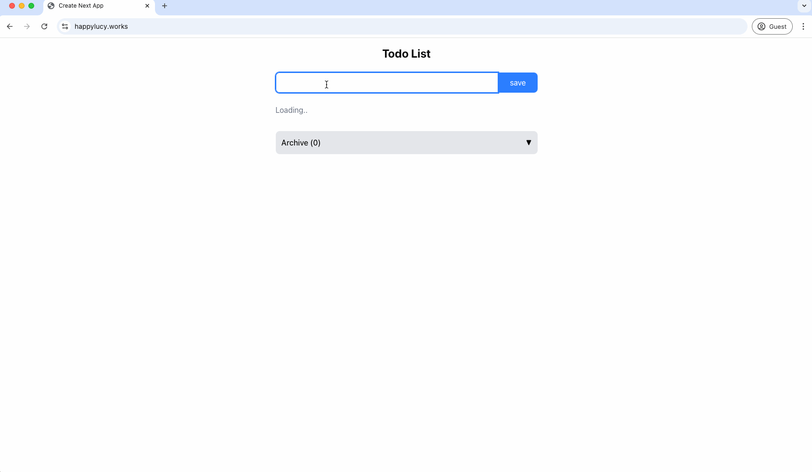

# Todo Single Page Application(SPA)

Brief description of your project - what it does and what problem it solves.

## Architecture

This project consists of:

- Frontend: Next.js application
- Backend: Express.js API
- Database: MySQL

## Demo



## Prerequisites

- [Docker](https://www.docker.com/get-started)
- [Docker Compose](https://docs.docker.com/compose/install/)
- [Git](https://git-scm.com/downloads)

## Getting Started

### Clone the repository

```bash
git clone https://github.com/haebin-lee/spa-source.git
cd spa-source
```

### Run with Docker Compose

```bash
docker compose up --build -d
```

### Access the application

- Frontend: http://localhost:3000
- Backend API: http://localhost:8080

### Project Structure

```
├── docker-compose.yml
├── frontend/               # Next.js application
│   ├── Dockerfile
│   └── ...
├── backend/                # Express.js API
│   ├── Dockerfile
│   └── ...
└── README.md
```

### Features

- Todo creation
- Mark todos as complete/incomplete
- List all todos
